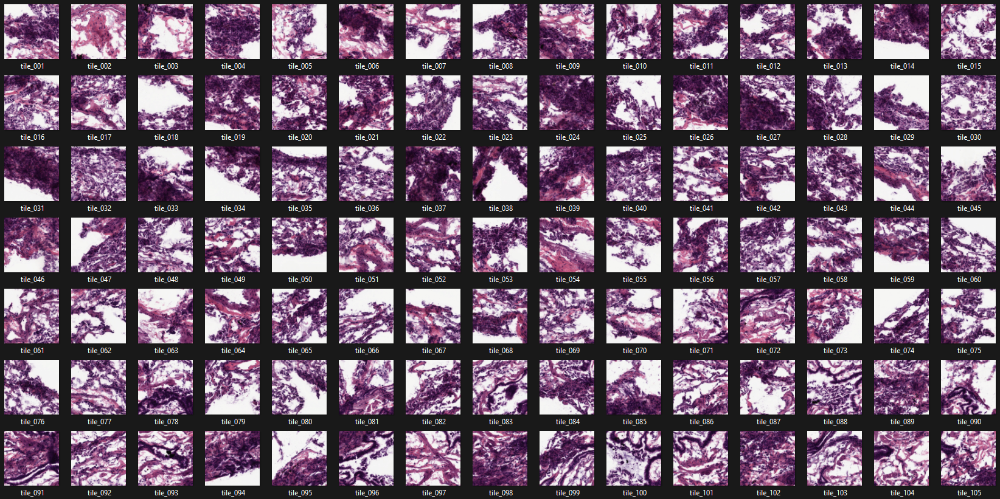
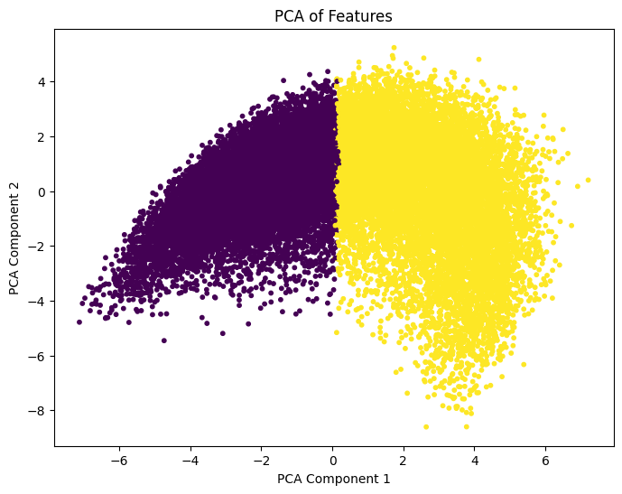
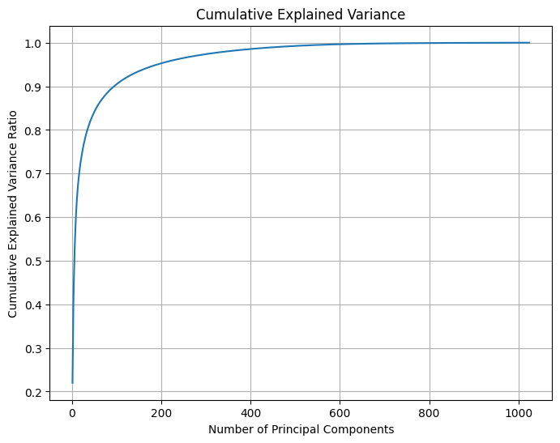
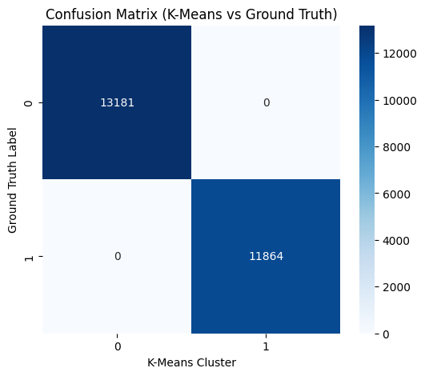
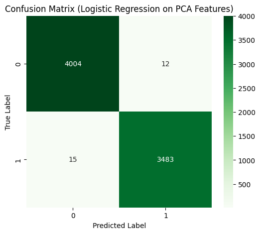
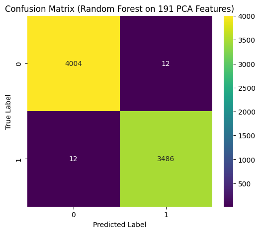
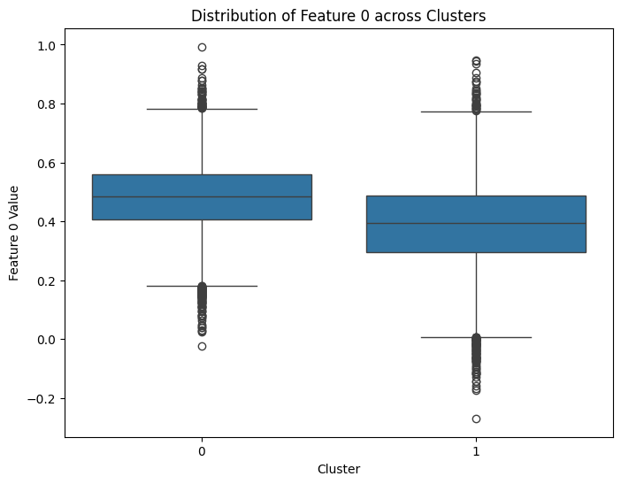

# Classification prediction from lung cancer histopathology images using deep learning



## 📌 Overview

This project applies **unsupervised learning** techniques such as **K-Means Clustering** and **Principal Component Analysis (PCA)** on deep features extracted from **lung cancer histopathology images** using a pretrained **ConvNeXt** model. The goal is to cluster and visualize patterns in cancer subtypes without using labeled data.

---

## 🧪 Key Objectives

- 📷 Process and normalize histopathology images  
- 🔍 Extract deep features using `ConvNeXt-Base` pretrained model  
- 📉 Reduce feature dimensions using PCA  
- 📊 Cluster the reduced features with K-Means  
- 🧮 Evaluate cluster-label alignment

---

## 🛠️ Technologies Used

| Library         | Purpose                                  |
|------------------|--------------------------------------------|
| PyTorch          | Model loading, training, and inference     |
| Torchvision      | Image preprocessing and dataset loading    |
| ConvNeXt         | Pretrained model for feature extraction    |
| Scikit-learn     | PCA, K-Means, evaluation metrics           |
| Matplotlib/Seaborn | Plotting confusion matrix and PCA graphs |

---

## 📥 Installation

### 1️⃣ Clone repository

```bash
git clone https://github.com/jagadishdas21/lung-cancer.git
cd lung-cancer
```

### 2️⃣ Install dependencies

```bash
pip install -r requirements.txt
```
### 3️⃣ Run notebook

```bash
jupyter notebook convnext.ipynb
```
### 4️⃣ Data directory
```bash
./resized_data/
```
---

## 🔍 Methodology

### 1️⃣ Data Preprocessing
- Images are resized to `224x224`
- Dataset normalization using computed `mean` and `std`

```python
transform = transforms.Compose([
    transforms.Resize((224, 224)),
    transforms.ToTensor(),
    transforms.Normalize(mean, std)
])
```

### 2️⃣ Feature Extraction with ConvNeXt
- Pretrained ConvNeXt-Base model is used to extract high-dimensional embeddings from each image:
```python
model = convnext_base(weights=ConvNeXt_Base_Weights.DEFAULT)
```

### 3️⃣ PCA – Dimensionality Reduction
- PCA reduces 1000+ features to 2 components
- Helps visualize cluster formation and explained variance

### 4️⃣ K-Means Clustering
- Clusters are formed on PCA-reduced features
- The elbow method helps determine the optimal number of clusters

### 5️⃣ Cluster Evaluation

- Mean of Original Features
- Variance of Original Features

---

## 📈 Results

| 🔍 Result Type           | 📝 Description                                  | 🖼️ Preview |
|--------------------------|------------------------------------------------|------------|
| 1️⃣ **PCA** | - Scatter plot of first 2 PCA components.<br> - Shows clear separation between two clusters.<br> - Indicates PCA captured meaningful variance and class separability.|  |
| 2️⃣ **Variance**| - Line plot of cumulative variance vs. number of components.<br> - ~200 components explain most variance.<br> - Useful for dimensionality reduction decision. |  |
| 3️⃣ **Confusion Matrix**  | - Clustering by K-Means:<br> - 13,181 samples → class 0.<br> - 11,864 samples → class 1.<br> - No misclassifications; exact cluster-label match. |  |
| 4️⃣ **Confusion Matrix**  | - Used PCA-reduced features to train a logistic regression model.<br> - Achieved high accuracy with 3,483 TP, 4,004 TN, 15 FP and 12 FN.<br> - Proves that PCA simplifies data effectively for linear classifiers. |  |
| 5️⃣ **Confusion Matrix**  | - Trained a Random Forest on 191 PCA components.<br> - Model predicted 3,486 TP and 4,004 TN, with just 12 FP and 12 FN.<br> - Shows ensemble learning with PCA enhances classification slightly better than logistic regression.|  |
| 6️⃣ **Cluster Statistics** | - Boxplot of Feature 0 for each cluster.<br> - Similar medians; small spread difference.<br> - Feature 0 mildly contributes to cluster separation. |  |

---
