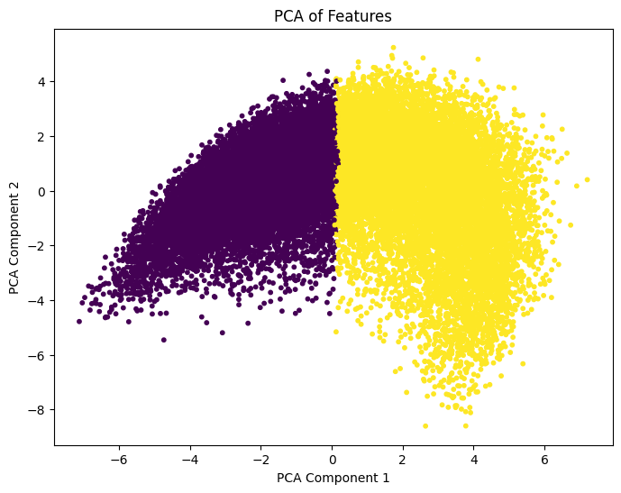
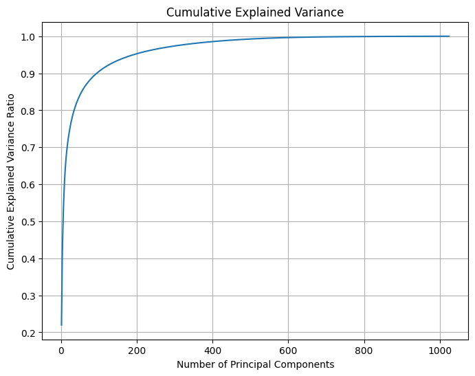
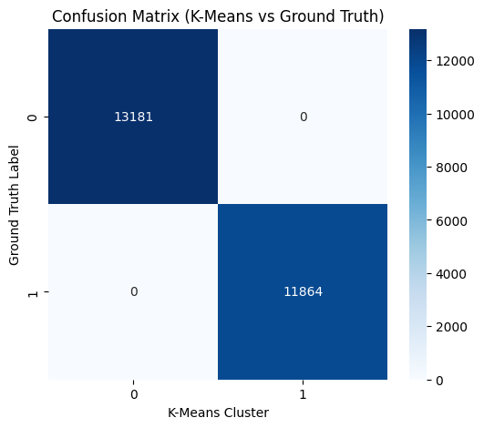

# Classification prediction from lung cancer histopathology images using unsupervised learning


## 📌 Overview

This project applies **unsupervised learning** techniques such as **K-Means Clustering** and **Principal Component Analysis (PCA)** on deep features extracted from **lung cancer histopathology images** using a pretrained **ConvNeXt** model. The goal is to cluster and visualize patterns in cancer subtypes without using labeled data.

---

## 🧪 Key Objectives

- 📷 Process and normalize histopathology images  
- 🔍 Extract deep features using `ConvNeXt-Base` pretrained model  
- 📉 Reduce feature dimensions using PCA  
- 📊 Cluster the reduced features with K-Means  
- 🧮 Evaluate cluster-label alignment with precision, recall, F1, and AUC metrics

---

## 🛠️ Technologies Used

| Library         | Purpose                                  |
|------------------|--------------------------------------------|
| PyTorch          | Model loading, training, and inference     |
| torchvision      | Image preprocessing and dataset loading    |
| ConvNeXt         | Pretrained model for feature extraction    |
| scikit-learn     | PCA, K-Means, evaluation metrics           |
| Matplotlib/Seaborn | Plotting confusion matrix and PCA graphs |

---

## 📥 Installation

### 1️⃣ Clone repository

```bash
git clone https://github.com/jagadishdas21/lung-cancer.git
cd lung-cancer
```

### 2️⃣ Install dependencies

```bash
pip install -r requirements.txt
```
### 3️⃣ Run notebook

```bash
jupyter notebook convnext.ipynb
```
### 4️⃣ Data directory
```bash
./resized_data/
```

## 🔍 Methodology

### 1️⃣ Data Preprocessing
- Images are resized to `224x224`
- Dataset normalization using computed `mean` and `std`

```python
transform = transforms.Compose([
    transforms.Resize((224, 224)),
    transforms.ToTensor(),
    transforms.Normalize(mean, std)
])
```

### 2️⃣ Feature Extraction with ConvNeXt
- Pretrained ConvNeXt-Base model is used to extract high-dimensional embeddings from each image:
```python
model = convnext_base(weights=ConvNeXt_Base_Weights.DEFAULT)
```

### 3️⃣ PCA – Dimensionality Reduction
- PCA reduces 1000+ features to 2 components
- Helps visualize cluster formation and explained variance

### 4️⃣ K-Means Clustering
- Clusters are formed on PCA-reduced features
- The elbow method helps determine the optimal number of clusters

### 5️⃣ Cluster Evaluation

--- Cluster Statistics (Mean of Original Features) ---
             0         1         2         3         4         5         6     \
cluster                                                                         
0        0.481057  0.004227  0.091866 -0.196212  0.882134  0.357533 -0.210301   
1        0.389309 -0.089795  0.119008 -0.223080  0.654626  0.204968 -0.167408   

             7         8         9     ...      1014      1015      1016  \
cluster                                ...                                 
0       -0.058194 -0.127493 -0.139752  ... -0.245387 -0.123599  0.415986   
1       -0.209678 -0.140291 -0.062310  ... -0.372383 -0.070261  0.388459   

             1017      1018      1019      1020      1021      1022      1023  
cluster                                                                        
0        0.214523 -0.076967  0.032559 -0.144722  0.124687 -0.110187  0.184081  
1        0.182593 -0.000511 -0.016183 -0.127436  0.109619 -0.076031  0.109290  

[2 rows x 1024 columns]

--- Cluster Statistics (Variance of Original Features) ---
             0         1         2         3         4         5         6     \
cluster                                                                         
0        0.013140  0.015929  0.012625  0.020206  0.043837  0.015792  0.016325   
1        0.021321  0.022763  0.019759  0.029388  0.058412  0.027161  0.016696   

             7         8         9     ...      1014      1015      1016  \
cluster                                ...                                 
0        0.014955  0.012115  0.008283  ...  0.018692  0.012284  0.014699   
1        0.020588  0.025141  0.010343  ...  0.020192  0.015207  0.020244   

             1017      1018      1019      1020      1021      1022      1023  
cluster                                                                        
0        0.015502  0.016849  0.014357  0.018054  0.018111  0.019467  0.010294  
1        0.018597  0.032070  0.017944  0.022177  0.026070  0.017520  0.016034  

[2 rows x 1024 columns]

## 📈 Results

| 🔍 Result Type           | 📝 Description                                  | 🖼️ Preview |
|--------------------------|------------------------------------------------|------------|
| 1️⃣ **PCA** | Principle component analysis of features |  |
| 2️⃣ **Variance**| Explained variance ratio of first two components: 0.220, 0.096 |  |
| 3️⃣ **Confusion Matrix**  | Evaluating Clustering against Ground Truth |  |
| 4️⃣ **Confusion Matrix**  | Logistic regression on PCA features |  |
| 5️⃣ **Confusion Matrix**  | Random forest on 191 PCA features |  |
| 6️⃣ **Cluster Statistics** | Distribution of feature across clusters |  |

---
